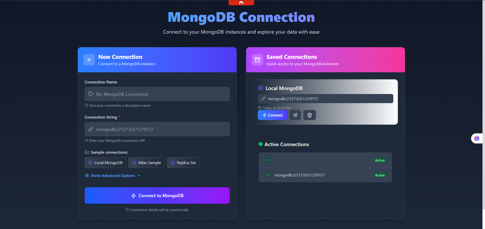
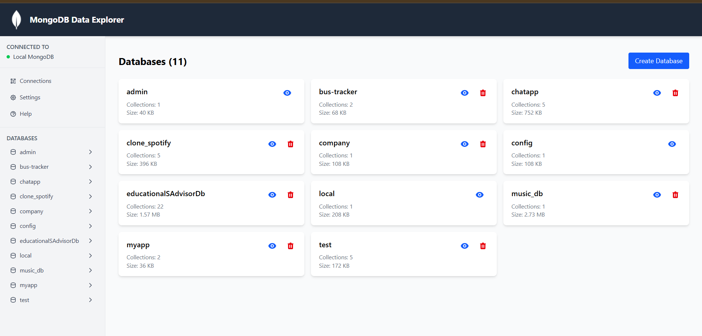
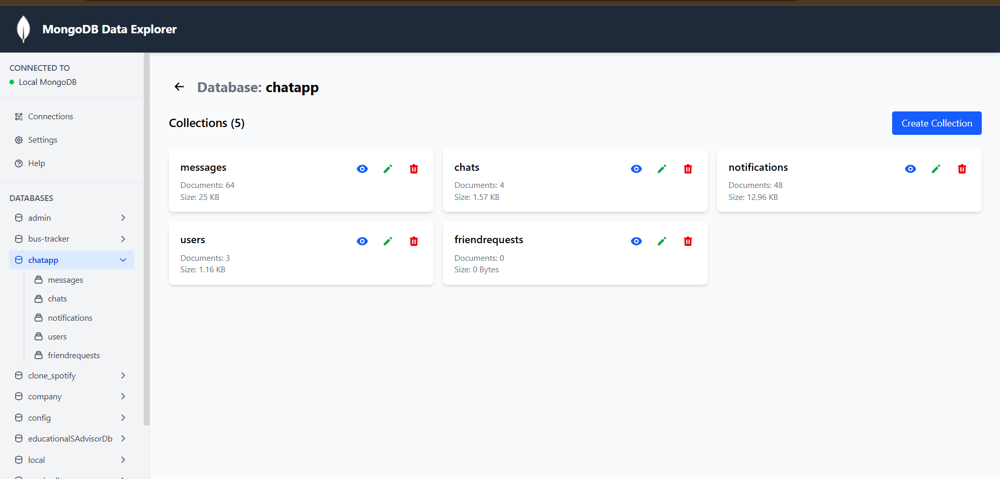
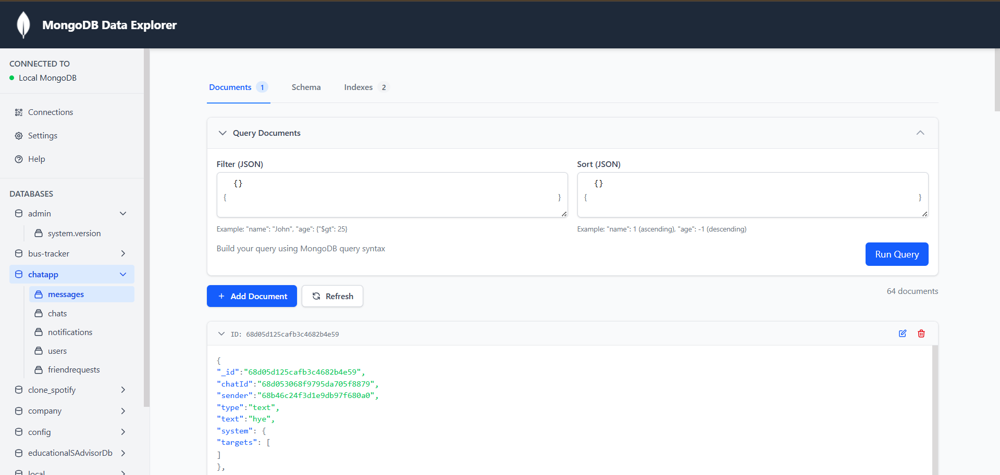
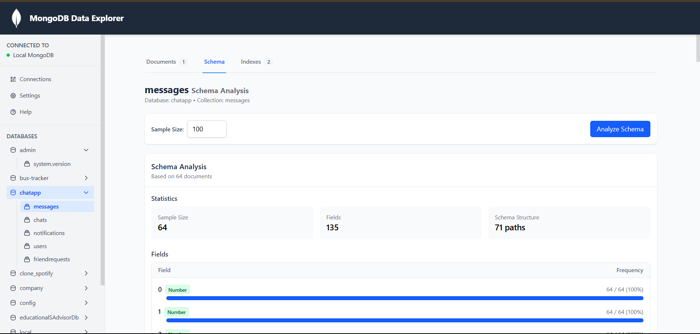
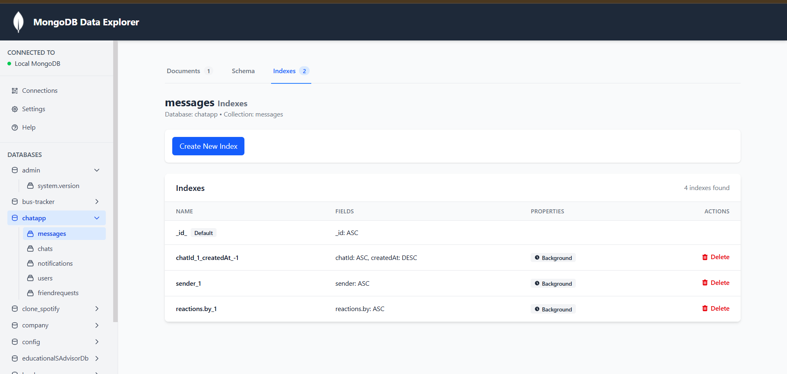

# MongoDB Data Explorer and Analyzer - Frontend

A modern React-based frontend for MongoDB data exploration and analysis, providing an intuitive and responsive user interface to interact with MongoDB databases, collections, and documents.

## 🚀 Features

- **Connection Management**: Connect to any MongoDB instance with connection string
- **Database Explorer**: Browse and manage MongoDB databases
- **Collection Viewer**: Explore and manipulate collections
- **Document Browser**: Advanced document viewing and editing with filtering and pagination
- **Schema Analyzer**: Visual representation of collection schemas
- **Index Management**: Create and manage indexes for optimized queries
- **Responsive Design**: Works on desktop and mobile devices
- **Dark/Light Mode**: Customizable UI theme

## 📸 Screenshots

### Connection Page

*Connect to MongoDB instances and manage saved connections*

### Databases Page

*Browse and manage databases in your MongoDB instance*

### Collections Page

*View and manage collections within a database*

### Documents Page

*Browse, filter, and edit documents with advanced query capabilities*

### Schema Page

*Analyze collection schema and field distributions*

### Indexes Page

*Manage indexes for optimized query performance*

## 📋 Tech Stack

- **React**: UI library with hooks and context API
- **Vite**: Fast build tool and development server
- **React Router**: Client-side routing
- **Tailwind CSS**: Utility-first CSS framework
- **Axios**: HTTP client for API requests
- **Framer Motion**: Animation library for smooth transitions
- **React DnD**: Drag and drop functionality for interactive UI
- **React Resizable**: Resizable panels and components
- **React Toastify**: Toast notifications for user feedback
- **Vitest**: Testing framework for unit and integration tests

## 🛠️ Project Structure

```
Front-end/
├── Contexts/                # React context providers
│   ├── confirm-context.jsx  # Confirmation dialog context
│   ├── sidebar-context.jsx  # Sidebar state management
│   └── toast-Contex.jsx     # Toast notifications
├── public/                  # Static assets and screenshots
├── src/
│   ├── assets/              # Images, icons, etc.
│   ├── components/          # Reusable UI components
│   │   ├── common/          # Shared components (buttons, inputs, etc.)
│   │   ├── connection/      # Connection related components
│   │   ├── documents/       # Document viewer/editor components
│   │   └── layout/          # Layout components (header, sidebar, etc.)
│   ├── hooks/               # Custom React hooks
│   ├── pages/               # Page components
│   │   ├── ConnectionPage.jsx
│   │   ├── DatabasesPage.jsx
│   │   ├── CollectionsPage.jsx
│   │   ├── DocumentsPage.jsx
│   │   ├── SchemaPage.jsx
│   │   └── IndexesPage.jsx
│   ├── services/            # API services
│   │   └── api.js           # API client
│   └── tests/               # Unit and integration tests
```

## 📱 Pages and Features

### Connection Page
- Connect to MongoDB instances with connection string
- Save and manage multiple connection strings
- Test connection status before connecting
- Secure storage of connection information
- Quick connect to recently used connections

### Databases Page
- List all databases in the connected MongoDB instance
- View database statistics and metadata
- Create new databases with custom options
- Drop existing databases with confirmation
- Search and filter databases by name

### Collections Page
- Browse collections within a selected database
- View collection metadata and statistics
- Create new collections with validation rules
- Rename existing collections
- Drop collections with confirmation dialog
- Sort collections by name, size, or document count

### Documents Page
- View documents in table or JSON format
- Advanced filtering with MongoDB query syntax
- Pagination for large collections
- Sort documents by any field
- Insert new documents with JSON editor
- Update existing documents with form or JSON editor
- Delete documents with confirmation
- Bulk operations support

### Schema Page
- Automatic schema detection and analysis
- Visualize field types and distributions
- Identify data inconsistencies and outliers
- Field frequency statistics
- Nested document structure visualization
- Export schema analysis

### Indexes Page
- View existing indexes and their properties
- Create new indexes with various options
- Set index types (single field, compound, text, etc.)
- Configure index options (unique, sparse, etc.)
- Drop unnecessary indexes
- Index usage statistics

## 🚦 Getting Started

### Prerequisites
- Node.js (v16 or higher)
- npm or yarn
- Running backend server

### Installation

1. Clone the repository
```bash
git clone https://github.com/yourusername/mongodb-data-explorer.git
cd mongodb-data-explorer/Front-end
```

2. Install dependencies
```bash
npm install
```

3. Create a `.env` file in the root directory with the following variables:
```
VITE_API_URL=http://localhost:4000/api
```

4. Start the development server
```bash
npm run dev
```

The application will be available at `http://localhost:5173`.

## 🧪 Testing

Run tests with:
```bash
npm test
```

Or in watch mode:
```bash
npm run test:watch
```

## 🔄 API Integration

The frontend communicates with the backend through a RESTful API. The API client is configured in `src/services/api.js` and uses Axios for HTTP requests.

Key API endpoints used:
- `/api/connect` - Connect to MongoDB instance
- `/api/databases` - List and manage databases
- `/api/databases/:dbName/collections` - List and manage collections
- `/api/databases/:dbName/collections/:collName/documents` - Query and manage documents
- `/api/databases/:dbName/collections/:collName/schema` - Analyze collection schema
- `/api/databases/:dbName/collections/:collName/indexes` - Manage indexes

## 🎨 UI/UX Features

- **Responsive Design**: Adapts to different screen sizes
- **Dark/Light Mode**: Toggle between themes
- **Toast Notifications**: User-friendly feedback
- **Confirmation Dialogs**: Prevent accidental operations
- **Loading States**: Visual feedback during operations
- **Error Handling**: User-friendly error messages
- **Keyboard Shortcuts**: Improve productivity
- **Drag and Drop**: Intuitive interaction
- **Resizable Panels**: Customize workspace layout

## 📝 License

This project is licensed under the ISC License.

## 🤝 Contributing

Contributions, issues, and feature requests are welcome!
